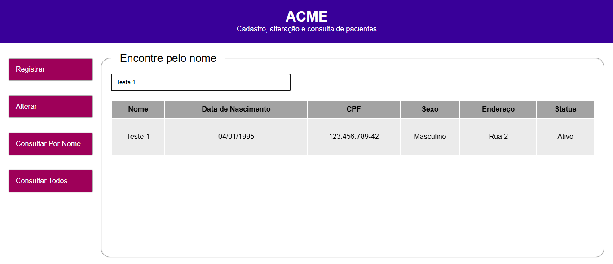

# Acme

## Atualizações

### 1.2

    - O projeto havia sido criado usando o comando Creact React App, por isso, foi reconfigurado com Vite

### 1.1

    - O projeto backend foi inicialmente desenvolvimento com javascript, agora sendo atualizado para typescript
    - Correção do frontend que não estava buscando os dados dos pacientes no banco de dados
    - Foi alterado o banco de dados de MySQL para SQLite, para maximizar o desenvolvimento.

## Layout

## Neste projeto vamos usar:

    - Framework - Reactjs
    - Banco de cados - SQLite

## Serão duas pastas:

    - Client - para o front-end
    - Server - para o back-end
  
## Rotas

    - get('/pacientes') - para acessar todos os usuários
    - post('/pacientes/registrar') - para cadastrar novo usuários
    - put('/pacientes/alterar/:cpf') - para alterar usuário
    - get('/create-table') - para criar a tabela
  
## Código

### Iniciar o projeto Back-End

    cd server >
    |
    yarn init
    |
    yarn
    |

### Bibliotecas Back-End

Cors - compartilhamento de recursos com origens diferentes - usa cabeçalhos adicionais HTTP para informar a um navegador que permita que um aplicativo Web seja executado em uma origem (domínio) com permissão para acessar recursos selecionados de um servidor em uma origem distinta.

    yarn add cors

Express - para acessar rotas

    yarn add express

Mysql - para conectar o banco de dados mysql ao projeto

    yarn add mysql

Nodemon - para que quando houver alteração no código, não precise reiniciar o servidor

    yarn add Nodemon

### Iniciar o projeto Front-End

    yarn create react-app client

### Bibliotecas Front-End

Sass - pré processador css

    yarn add sass

React Router Dom - para criar rotas no site

    yarn add react-router-dom

Axios - para acessar API

    yarn add axios

Formik - para criar formulário

    yarn add formik

Yup - para exibir mensagens no formulário, caso o usuário não faço o que é esperado

    yarn add yup
